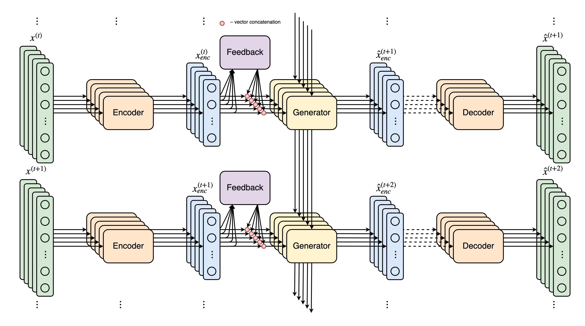
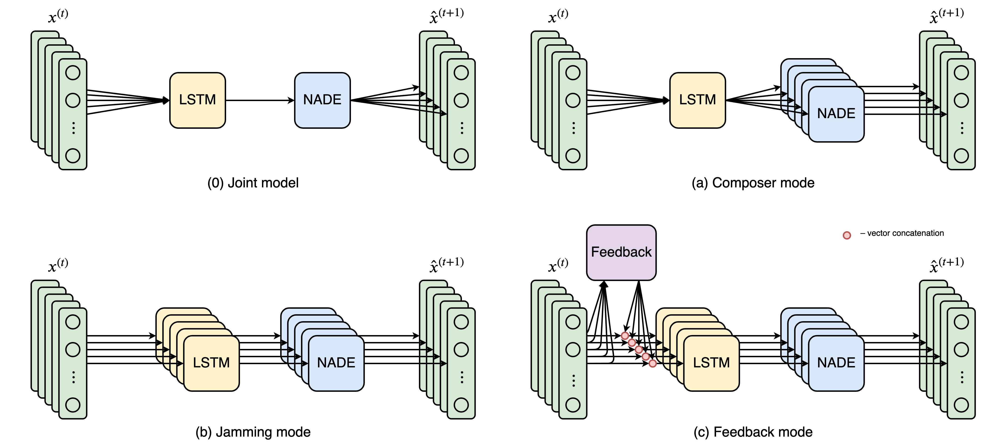

# MultINN – Multi-Instrumental Neural Network

Multi-Instrumental Neural Network framework for multi-track sequence generation.



## Getting Started

* [Description](#description)
* [Installation](#installation)
* [Experiments](#experiments)

## Description

[***MultINN***](https://github.com/ilya16/MultINN) is a modular Neural Network framework for training multi-track polyphonic sequence generation models. 

MultINN offers a solution to the main challenges in multi-instrumental sequence generation:
* inter-track relations and dependencies;
* multi-modal distributions of events in polyphonic sequences.

The inputs to the MultINN models are multi-track piano-rolls, sized `[batch_size, time_steps, num_dims, num_tracks]`.

### Framework modules

MultINN framework consists of two central modules:
* Feature [**Encoders**](multinn/models/encoders/encoder.py) – learn lower-dimensional dense latent vector representations of inputs at on time step.
* Sequence [**Generators**](multinn/models/generators/generator.py) – learn the conditional distributions of encoded features for each time step, given a sequence history of previous steps.

The modular architecture allows embedding and interchanging different Neural Network models for Encoder and Generator modules.

Each module can operate with all $M$ tracks at once or work only with one track.

#### Implemented modules
* Encoders: [PassEncoder](multinn/models/encoders/pass_encoder.py) (does not change the inputs), and [DBNEncoder](multinn/models/encoders/dbn_encoder.py).
* Generators: [LSTM-RBM](multinn/models/generators/rnn_rbm.py), [LSTM-NADE](multinn/models/generators/rnn_nade.py), and [LSTM-MultiNADE](multinn/models/generators/rnn_multinade.py) (a shared RNN and one NADE for each track).

### Multi-track operation modes

MultINN framework implements four operation modes for composing multi-track music:
* [Joint](multinn/models/multinn/multinn_joint.py) – one joint Encoder + one joint Generator for all tracks;
* [Composer](multinn/models/multinn/multinn_composer.py) – per-track Encoders + one Generator with shared temporal unit and per-track distribution estimators (e.g. [LSTM-MultiNADE]());
* [Jamming](multinn/models/multinn/multinn_jamming.py) – per-track Encoders + per-track Generators with no inter-communication;
* [Feedback](multinn/models/multinn/multinn_feedback.py) – per-track Encoders + per-track Generators + Feedback module connected with each Generator. Offers harmonious sequence generation. The Feedback module can be a [Dense layer](multinn/models/multinn/multinn_feedback.py) or a [Recurrent Neural Network](multinn/models/multinn/multinn_feedback_rnn.py).



## Installation

Clone the repository to install and test the framework using:
```
git clone https://github.com/ilya16/MultINN
```

Run the following commands from the root directory to install the enviroment requirements:
```
pip install -r requirements.txt
```

*Note*: The current version of the MultINN framework supports only [TensorFlow](https://www.tensorflow.org/) 1.xx releases.


## Experiments

The framework was tested for five-track music generation on the subset of [Lakh Pianoroll Dataset](https://salu133445.github.io/lakh-pianoroll-dataset/).

Follow the steps below to reproduce the experiments, or explore and run the [Google Colab notebook](https://colab.research.google.com/drive/1XExQnNkQWr1f9Ix9B0q4jp5BvOQIXIHo) with the examples.

### Loading the data
Load and preprocess the data used during the experiments using the following script:
```
sh scripts/load_dataset.sh
```

or download the data manually from [Google Drive](https://drive.google.com/file/d/12Z440hxJSGCIhCSYaX5tbvsQA61WD_RH/view) and preprocess it using:
```
python multinn/prepare_data.py --data-file $path --sample-size 40000
```

### Experiment set up
Set up the experiment by modifying the *experiment configurations file* [default_config.yaml](multinn/configs/default_config.yaml) and *model parameters file* [default_params.yaml](multinn/configs/default_params.yaml)

### Training
The current version of the framework trains Encoders separately to the Generators.

*Note*: Read the documentation for each Encoder/Generator class to find if it need (pre-)training or not.

#### Encoders
Run the following command to train the Encoders using the default configurations:
```
python train_encoders.py -e 200 --from-init -m $model_name -lr 1e-2
```

*Note*: Check [train_encoders.py](multinn/train_encoders.py) for all available arguments.


#### Generators
Run the following command to train the Generators using the default configurations:
```
python train.py -e 20 --from-init -m $model_name -lr 1e-2
```

*Note*: Check [train.py](multinn/train.py) for all available arguments.

The model's weights, [TensorBoard](https://www.tensorflow.org/tensorboard) summaries, and generated intemediate samples are saved in the `results` directory in the `$model_name` folder.

Run the following command to train the pre-trained Generators:

```
python train.py -e 20 -m $model_name -lr 1e-2  --reuse-config
```

### Evaluation
Run the following command to evaluate the trained model on the training and test data:
```
python eval.py -m $model_name --reuse-config
```

### Inference
Run the following command to generate new samples using the trained model:
```
python sample.py -m $model_name --reuse-config
```
